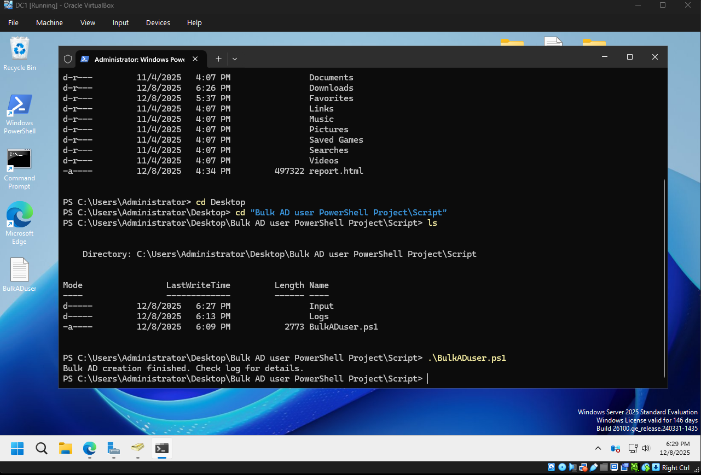
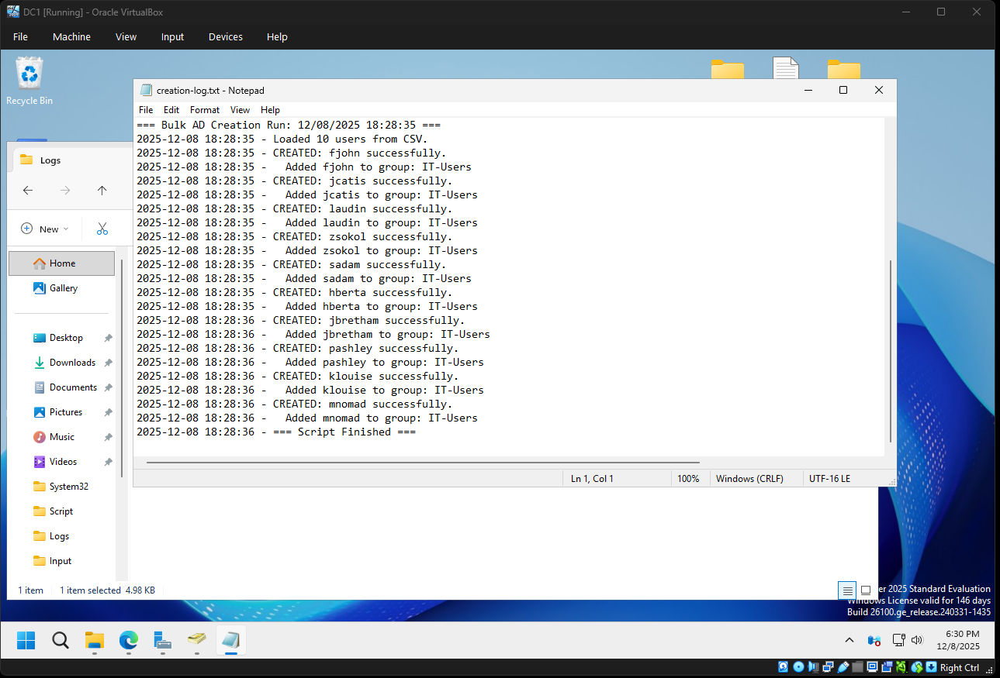
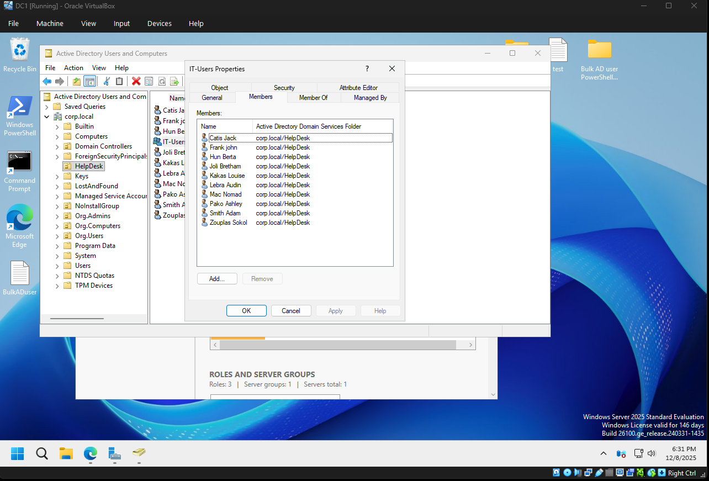

# 📁 Bulk Active Directory User Creation and password reset — PowerShell Automation

This project automates the creation of **Active Directory (AD) user accounts** using a CSV file, making it easy to onboard large numbers of users quickly and consistently.
This project automates the **resetting of passwords** for multiple Active Directory (AD) users using a **CSV file**, also demonstrates practical skills in **AD automation**, **bulk operations**, **PowerShell scripting**, **secure credential handling**, and **file output management**.
It is designed for IT administrators who need a **fast, consistent, and secure** way to reset many user passwords at once.

---

## ✨ Project Components

The automation script is a **production-style** tool designed to demonstrate IT administration, automation, and PowerShell skills. It includes:

* ✔ **CSV-driven user input**: Data for each user is sourced directly from a standard CSV file.
* ✔ **Per-user OU placement**: Supports placing each user in a different Organizational Unit.
* ✔ **Automatic group membership**: Manages group assignments during creation.
* ✔ **Random secure password generation**: Generates unique, secure passwords for each account.
* ✔ **Logging of all actions**: Comprehensive recording of success, skips, and errors.
* ✔ **Full error handling**: Robust logic to manage exceptions gracefully.
* ✔ **Idempotent execution**: Safely skips users that already exist.

---

## 🚀 Key Features

### 🔹 Bulk User Creation & Data Handling

The script reads user data from a CSV file and automatically creates each account in AD.

### 🔹 Directory Structure & Group Assignment

* **Per-User OU Support**: Each user's designated **Organizational Unit (OU)** is specified in the CSV, allowing for flexible AD structuring.
* **Automatic Group Assignment**: Users are added to security groups listed in the `Groups` column (supports **multiple groups** using a semicolon `;` as a delimiter).

### 🔹 Security & Passwords

Each user receives a **unique, randomly generated password**. The account is created with the **"password-change-on-login"** setting enabled for immediate security enforcement.

### 🔹 Logging & Error Handling

All activity is logged to a dedicated `creation-log.txt` file, recording:

* Successful creations
* Group assignments
* Skipped existing users
* Any errors encountered (e.g., OU not found, group not found)

### 🔹 Safe Re-Run / Idempotent

The script is safe to run repeatedly:

* **Existing accounts are skipped**, not overwritten or modified.
* **Only new users** present in the CSV are created on subsequent runs.

# 📂 Project Structure

This project follows a standard structure for PowerShell automation scripts:
``` text
Bulk AD user PowerShell Project
│
├── Script
│   ├── BulkADUser.ps1            # Project 1: AD User Creation
│   ├── ResetPasswords.ps1        # Project 2: Resets password only for users inside the users.csv file
│   │
│   ├── Input
│   │   └── users.csv             # Contains SamAccountName list for resets
│   │
│   ├── Logs
│   │   └── creation-log.txt      # Logs for Project 1
│   │
│   └── Passwords
│       └── passwords.csv         # Output file created by Project 2 script
│
└── README.md
```

---

## 📄 CSV Format

The primary input for the script is the **`Input/users.csv`** file. The script expects the following columns to successfully create the user accounts:

| Column Name | Description | Example Value |
| :--- | :--- | :--- |
| **SamAccountName** | The unique logon name for the user. | `jdoe` |
| **FirstName** | User's given name. | `John` |
| **LastName** | User's surname. | `Doe` |
| **DisplayName** | Full name as displayed in the AD Global Address List. | `John Doe` |
| **OUPath** | The distinguished name of the Organizational Unit (OU) where the user will be placed. | `OU=HelpDesk,DC=corp,DC=local` |
| **Groups** | Security groups to add the user to. Use a semicolon (`;`) to separate multiple groups. | `IT-Users;GroupB` |

### Example `users.csv` Entry:

| SamAccountName | FirstName | LastName | DisplayName | Department | Title | Phone | OU | Groups | Domain |
| :--- | :--- | :--- | :--- | :--- | :--- | :--- | :--- | :--- | :--- |
| **fjohn** | John | Frank | Frank john | IT | Tech | 7745678909 | OU=HelpDesk,DC=corp,DC=local | IT-Users | corp.local |
| **jcatis** | Jack | Catis | Catis Jack | IT | Tech | 7745678916 | OU=HelpDesk,DC=corp,DC=local | IT-Users | corp.local |
| **laudin** | Audin | Lebra | Lebra Audin | IT | Tech | 7745678917 | OU=HelpDesk,DC=corp,DC=local | IT-Users | corp.local |
| **zsokol** | Sokol | Zouplas | Zouplas Sokol | IT | Tech | 7745678918 | OU=HelpDesk,DC=corp,DC=local | IT-Users | corp.local |
| **sadam** | Adam | Smith | Smith Adam | IT | Tech | 7745678919 | OU=HelpDesk,DC=corp,DC=local | IT-Users | corp.local |
| **hberta** | Berta | Hun | Hun Berta | IT | Tech | 7745678920 | OU=HelpDesk,DC=corp,DC=local | IT-Users | corp.local |
| **jbretham** | Bretham | Joli | Joli Bretham | IT | Tech | 7745678921 | OU=HelpDesk,DC=corp,DC=local | IT-Users | corp.local |
| **pashley** | Ashley | Pako | Pako Ashley | IT | Tech | 7745678922 | OU=HelpDesk,DC=corp,DC=local | IT-Users | corp.local |
| **klouise** | Louise | Kakas | Kakas Louise | IT | Tech | 7745678923 | OU=HelpDesk,DC=corp,DC=local | IT-Users | corp.local |
| **mnomad** | Nomad | Mac | Mac Nomad | IT | Tech | 7745678924 | OU=HelpDesk,DC=corp,DC=local | IT-Users | corp.local |

---


## Column Descriptions

| Column | Purpose | Example / Notes |
| :--- | :--- | :--- |
| **SamAccountName** | Username / login name | `jdoe` |
| **FirstName** | User's first name | `John` |
| **LastName** | User's last name | `Doe` |
| **DisplayName** | Full display name in AD | `John Doe` |
| **Department** | Optional AD attribute | `IT` |
| **Title** | Job title |  `tech` 
| **Phone** | Phone number | `0767879801` |
| **OU** | Distinguished Name of the OU where the account will be created | `OU=HelpDesk, DC=corp,DC=local` |
| **Groups** | AD groups to join | Separate multiple using **`;`** (e.g., `HR;VPN_Users`) |
| **Domain** | Domain name for UPN | `corp.local` |

---

## 🛠️ How to Run the Script

Ensure Active Directory Module for PowerShell is installed.

1. Place the users.csv file inside:
```text
Script\Input\
```
2. Open PowerShell as Administrator.
3. Navigate to project directory:
```text
cd "C:\Users\Administrator\Desktop\Bulk AD user PowerShell Project\Script"
```
4. Run the script:
```powershell
.\BulkADUser.ps1
```
5. Check the log output and the passwords in:
```text
Script\Logs\creation-log.txt
```

---

## 📘 Example Output (Screenshots)

* 
* 
* 


---

## 🧠 What This Project Demonstrates

This project is an excellent addition to any portfolio as it showcases hands-on, practical IT skills, including:

* **PowerShell scripting:** Demonstrates core scripting logic, function use, and parameter handling.
* **Active Directory automation:** Proficient use of the `ActiveDirectory` PowerShell module.
* **Understanding of OUs, security groups, and domain structure:** Correct placement and attribute setting.
* **Working with CSV data:** Importing, iterating, and using structured data for automation.
* **Error handling and logging:** Implementing robust `try/catch` logic and output logging.
* **Real-world onboarding automation workflow:** Mimics a critical IT infrastructure task.

---

## 📜 License

This project is released under the **MIT License**.
Feel free to modify and use it in your environment or portfolio.

---

## 🙌 Credits

Created by **ITspcilst**, with a goal to automate user onboarding and demonstrate practical PowerShell & AD administration skills.
